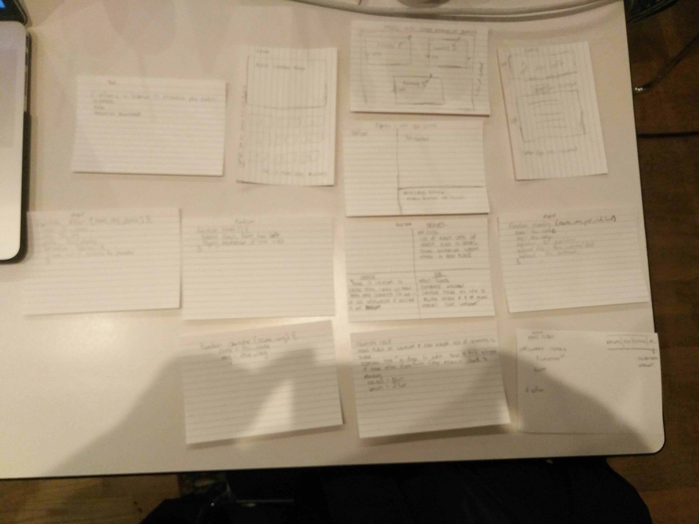

*** Kareem J / Oct, 6th ***

# Where in the world is Carmen Sandiego? Proposal

## What is Where in the world is Carmen Sandiego?

The game is where you (a gumshoe detective) has to catch Carmen Sandiego (a world renowed thief) around the world and arrest her before the clcok runs out

## Wireframe

## Initial thoughts on game structure

I think the logic is going to trip me up a bit, there is a bunch of things that I need to keep track of. Game state and where its at will be key to making everything work. I feel weaker in logic so I wanted to push myself a bit.

## Phases of Completion

phase -4: Fill out my 3x5 cards and get a lay of the landscape

phase -3: Arrange my divs and get the layout roughly together

phase -2: Get the javascript working for each 3 x 5 card

phase -1: Connecting all the javascript together

phase 0: MVP

phase 1: expand the game for further by adding more people places and things 

## Links and Resources
| Description | URL |
| --- | --- |
| Where in the World is Carmen Sandiego Deluxe Edition | https://classicreload.com/where-in-the-world-is-carmen-sandiego-deluxe-edition.html |
| Where In The World Is Carmen Sandiego Board Games | http://www.boardgamecapital.com/where-in-the-world-is-carmen-sandiego-rules.htm |
| Where in the World is Carmen Sandiego? Instructions | https://media.wix.com/ugd/05f72c_977f441a32474b37beb57043a514158a.pdf |
| Where in the World is Carmen Sandiego in Javascript | http://www.webstepbook.com/supplements/homework/10-carmen_sandiego/ |
| --- | --- |
